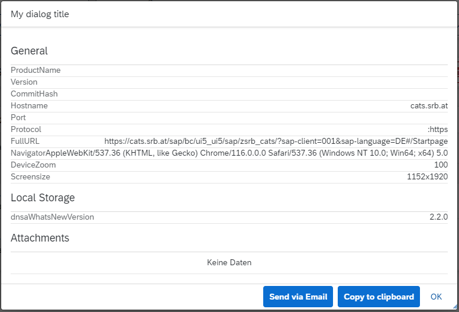
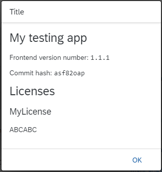
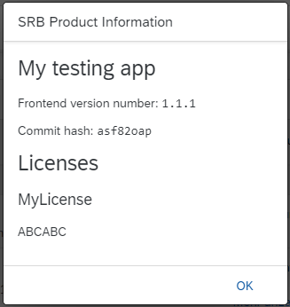

# SRBInfoAndSupportJS

[](https://www.srb.at)\
\
[](https://www.srb.at/blog--events/) [](https://www.srb.at/produkte/) [](https://github.com/SRBConsultingTeam/) [](https://www.npmjs.com/package/srbinfoandsupportjs) [](LICENSE)

## Getting started

**Initialize the SRBJSLogger via the NPM CDN:**

For initializing the Logger via CDN, simply copy and paste the following in the index file of the HTML5 app:

```markup
<script src="https://npmcdn.com/srbinfoandsupportjs/src/SRBInfoAndSupport.js"></script>
```

Or use the minified version

```markup
<script src="https://npmcdn.com/srbinfoandsupportjs/src/SRBInfoAndSupport.min.js"></script>
```

**Initialize SRBInfoAndSupportJS via downloading the latest version:**

Download the latest minified version from [here](https://npmcdn.com/srbinfoandsupportjs/src/SRBInfoAndSupport.min.js). Place that file into a directory of the app's folder structure, where it can access that file. For UI5 apps, using the index.html bootrapping, instantiate the Logger like above via

```markup
<script src="/path/to/SRBInfoAndSupport.min.js"></script>
```

For UI5 apps, not using the index.html startup logic, paste the following in the ressources section of the manifest file:

```json
"resources": { "js": [ { "uri": "path/to/SRBInfoAndSupport.min.js" } ] }
```

**Initialize the Logger temporarily via the browsers console. Just copy, paste and execute the following snippet in the browsers console:**

```js
var script = document.createElement("script");
script.type = "text/javascript";
script.src = "https://npmcdn.com/srbinfoandsupportjs/src/SRBInfoAndSupport.min.js";
script.addEventListener("load", function () {
  SRBInfoAndSupport.init({
    appname: "My testing app",
    version: "1.1.1",
    licenses: { MyLicense: "ABCABC" },
    copyright: "My version of the copyright",
    latestCommitHash: "asf82oap",
  });
});

document.head.appendChild(script);
```

## Documentation

> The documentation on this page is just an overview of the most relevant functions and features. Consider reading the [JSDoc page!](./SRBInfoAndSupport_JSDOC.md)

### The init function

```js
SRBInfoAndSupport.init({
  appname: "My testing app",
  version: "1.1.1",
  licenses: { MyLicense: "ABCABC" },
  copyright: "My version of the copyright",
  latestCommitHash: "asf82oap",
});
```

or, if using the manifest properties instead:

```js
SRBInfoAndSupport.init();
```

**Parameters**\
\
`init(config[{}])`

- **config** - optional
  Configuration object for the init function. If provided, the following config object has to be used:

  ```json
  {
    "appname": "",
    "version": "",
    "licenses": {
      "MyLicense": ""
    },
    "copyright": "",
    "latestCommitHash": "asf82oap"
  }
  ```

  If this configuration object is not provided, the library is searching for manifest properties of the UI5 app, that is using the library.

  Example manifest.json configuration:

  ```json
    {
      "_version": "1.0.162",
      "_srbVersionInfo": {
        "productName": "SRB Workspaces",
        "latestCommitHash": "3704aa5",
        "copyright": "© Copyright 2022 SRB Consulting Team GmbH. All Rights Reserved.",
        "licenses": {
          "SRB Workspaces": "",
          "html2canvas": "Copyright (c) Microsoft Corporation. Permission to use, copy, modify, and/or distribute this software for any purpose with or without fee is hereby granted. THE SOFTWARE IS PROVIDED 'AS IS' AND THE AUTHOR DISCLAIMS ALL WARRANTIES WITH REGARD TO THIS SOFTWARE INCLUDING ALL IMPLIED WARRANTIES OF MERCHANTABILITY AND FITNESS. IN NO EVENT SHALL THE AUTHOR BE LIABLE FOR ANY SPECIAL, DIRECT, INDIRECT, OR CONSEQUENTIAL DAMAGES OR ANY DAMAGES WHATSOEVER RESULTING FROM LOSS OF USE, DATA OR PROFITS, WHETHER IN AN ACTION OF CONTRACT, NEGLIGENCE OR OTHER TORTIOUS ACTION, ARISING OUT OF OR IN CONNECTION WITH THE USE OR PERFORMANCE OF THIS SOFTWARE."
        }
      },
      ...
    }

  ```

---

### The support dialog function

```js
SRBInfoAndSupport.showSupportDialog("My dialog title", {
  captureScreenshot: true,
});
```

**Parameters**\
\
`showSupportDialog(title[String], config[{}])`

- **title** - optional

  The shown title of the support dialog

- **config** - optional
  Configuration object, configuring the support dialog.

  - **captureScreenshot** true|false
    Indicates if a screenshot of the app shall be captured.
    For this, a extrenal library `html2canvas` is necessary. This library is not shipped with the SRBInfoAndSupportJS. See https://github.com/niklasvh/html2canvas for how to initialize the library.

    Quick and dirty example that is initializing `html2canvas`. You can use it in the browser console:

    ```js
    var script = document.createElement("script");
    script.type = "text/javascript";
    script.src = "https://github.com/niklasvh/html2canvas/releases/download/v1.4.1/html2canvas.min.js";
    document.head.appendChild(script);
    ```

  Example:

  ```json
  {
    "captureScreenshot": true
  }
  ```

\
\
**Results in**



---

### The overview dialog function

```js
SRBInfoAndSupport.showOverviewDialog("Title");
```

**Parameters**\
\
`showOverviewDialog(title[String])`

- **title**

  The title of the info dialog

**Results in**



### The initializing hidden info

This function initializes a hidden feature. The feature is open the overview dialog or the support dialog, or both. The magic thing is that the dialogs are shown only after clicking on a specific DOM element a specific number of times in a specific time range. The number of clicks is `10` in a time range of `2000` milliseconds.

The DOM element that has to be clicked can be forwarded to the function via the parameter `domElementId`. What will be showing is set via `overviewDialog` and/or `supportDialog`.

```js
SRBInfoAndSupport.initHiddenInfo({
  overviewDialog: true,
  supportDialog: false,
  domElementId: "__component0---Startpage--filterSearch",
});
```

**Parameters**\
\
`initHiddenInfo(config[{}])`

- **config** - optional
  Configuration object, configuring the hidden info feature.

  - **overviewDialog** true|false - optional

    Shows the overview dialog if the hidden info is triggered by the user.

  - **supportDialog** true|false - optional

    Shows the support dialog if the hidden info is triggered by the user.

  - **domElementId** String - optional

    The DOM element ID that the user has to click.

    **Results in**


